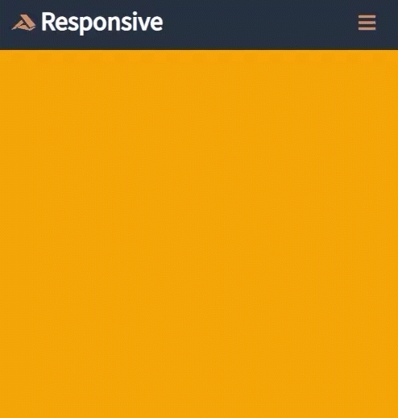
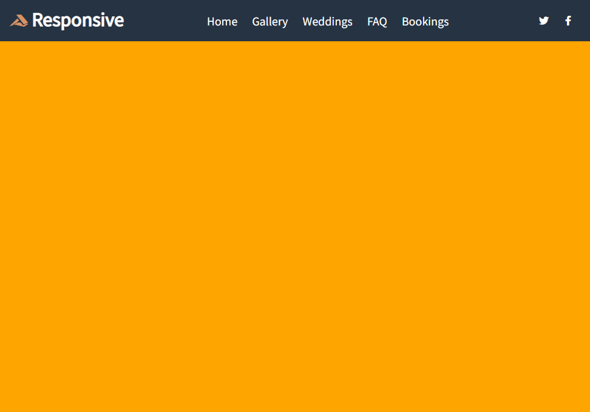

# Responsive Header 1

[This video](https://www.youtube.com/watch?v=X91jsJyZofw) taught me how to make a responsive header.

[DEMO](https://reverent-varahamihira-04851b.netlify.app/)

## Screenshots

